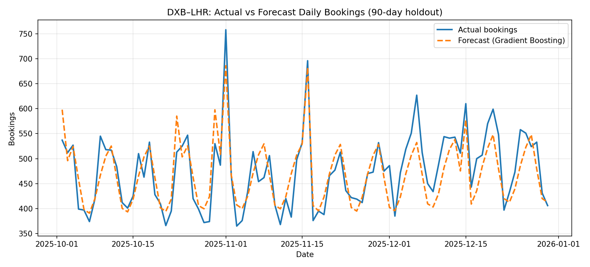
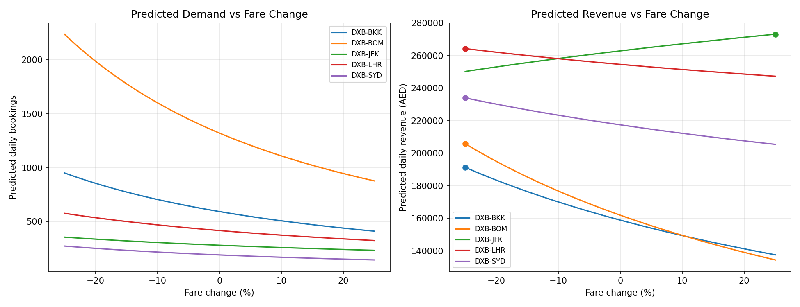
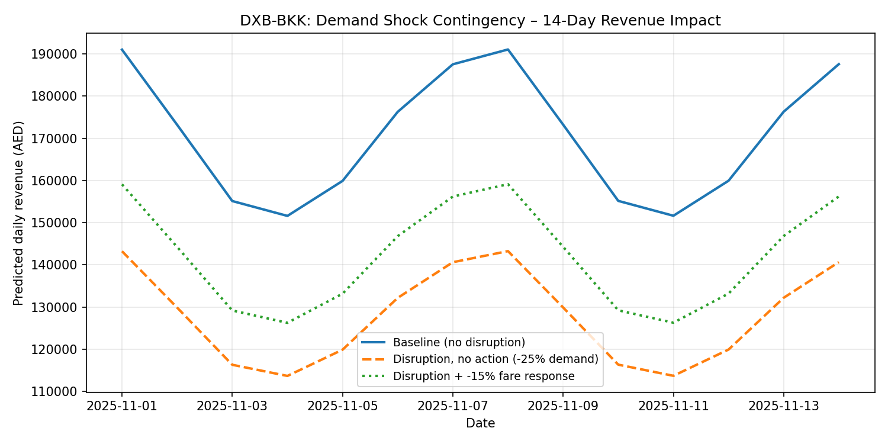

# Airline Demand Forecasting & Revenue Optimization Simulator

**Goal:** Forecast route-level demand, quantify price elasticity, and simulate
fare "what-if" scenarios and demand-shock contingencies to support
data-driven revenue decisions — the kind of workflow used by airline revenue
management and systems analytics teams.

Built as a self-contained, reproducible project using a realistic synthetic
booking dataset (5 long-haul routes, 2 years of daily data), since live
airline booking systems aren't publicly accessible.

---

## 1. Problem framing

Revenue optimization teams need to answer three linked questions every day:

1. **How much demand should we expect** on each route, given season, day of
   week, and any promotions running? *(forecasting)*
2. **How sensitive is that demand to price**, so fares can be set to maximize
   revenue rather than just fill seats? *(elasticity / pricing)*
3. **What happens to revenue if something unexpected occurs** — a disruption,
   a competitor's fare war, a demand shock — and does a proposed fare
   response actually help? *(scenario / contingency modelling)*

This project builds a small pipeline that answers all three.

---

## 2. Data

Synthetic daily data for 5 Emirates-style long-haul routes (DXB–LHR,
DXB–JFK, DXB–BOM, DXB–SYD, DXB–BKK), Jan 2024 – Dec 2025 (3,650 rows).

Each route has:
- an underlying **growth trend**
- **weekly seasonality** (higher weekend/Thursday travel, leisure-skewed)
- **annual seasonality** (a summer peak and a winter-holiday bump)
- **route-specific price elasticity** (e.g. DXB–BOM is highly price-sensitive
  at 1.8; DXB–JFK is comparatively inelastic at 0.8, consistent with a
  business-travel-heavy long-haul route)
- random **promotional fare events** (~8% of days)
- realistic noise

*(`src/generate_data.py`)*

---

## 3. Demand forecasting model

A Gradient Boosting Regressor is trained on time features (day-of-week and
day-of-year Fourier terms, a linear trend index), price, promo flag, and
route, to predict daily bookings. Evaluated on a 90-day holdout per route:

| Metric | Model | Naive baseline (same day, prior week) |
|---|---|---|
| MAE | 73.9 bookings/day | 89.6 bookings/day |
| RMSE | 144.2 bookings/day | – |
| MAPE | 8.81% | 10.66% |

**The model reduces forecast error by ~17.5% versus a naive same-day-last-week
baseline.** Feature importance confirms price (0.82) and the underlying
trend (0.10) as the dominant demand drivers, matching how the data was
constructed and giving confidence the model is learning the right signal
rather than overfitting noise.

*(`src/forecast_model.py` → `outputs/forecast_accuracy.png`)*



---

## 4. Price elasticity estimation

Gradient-boosted trees are not well-suited to representing a *smooth*
economic relationship like price elasticity — checked empirically, the raw
tree-based price response was noisy and locally non-monotonic near the
current fare, which is unusable for a pricing decision.

Instead, elasticity is estimated **per route** with a log-log regression of
bookings on price, controlling for weekday and monthly seasonal dummies and
a linear trend — the standard econometric approach for isolating a price
effect from confounding seasonal demand swings.

| Route | Estimated elasticity | (True elasticity, for validation) |
|---|---|---|
| DXB-LHR | 1.13 | 1.1 |
| DXB-JFK | 0.83 | 0.8 |
| DXB-BOM | 1.83 | 1.8 |
| DXB-SYD | 1.26 | 1.3 |
| DXB-BKK | 1.65 | 1.6 |

The estimator recovers the true underlying elasticity to within ~0.05 on
every route — validating the approach before it's used for pricing
decisions. (In production, this step would instead be validated against
held-out A/B fare tests rather than a known ground truth.)

Demand under a fare change is then modelled as:

```
demand(price) = baseline_demand(date, route)  ×  (price / reference_price) ^ (–elasticity)
```

where `baseline_demand` comes from the ML forecaster (season/trend/promo)
and the elasticity term captures the price response — combining the two
methods rather than relying on either alone.

*(`src/scenario_simulation.py` → `outputs/price_optimization_curve.png`)*



**Reading the result:** routes with elasticity > 1 (BOM, BKK, SYD, LHR)
show revenue continuing to rise as fares are discounted further within the
tested ±25% range — economically correct for price-elastic, leisure-skewed
demand. DXB–JFK (elasticity 0.8, business-travel-heavy) shows the opposite:
revenue rises as fares increase. This is the kind of route-by-route
segmentation a revenue analyst would use to prioritize where discounting
helps and where it doesn't — in production, the discount side would
additionally be bounded by a cost floor and capacity constraints not modelled
here.

---

## 5. Demand-shock contingency scenario

Simulates an unplanned 14-day, –25% demand shock on DXB–BKK (e.g. a
disruption or a competitor capacity change) and evaluates a proposed
mitigating response — a temporary 15% fare cut — using the same elasticity
model.



| Scenario | 14-day revenue impact |
|---|---|
| Revenue lost, no action taken | –AED 597,341 |
| Revenue lost, with –15% fare-cut response | –AED 399,144 |
| **Revenue recovered by taking action** | **+AED 198,197 (33.2% of the loss offset)** |

This is the core "react to unanticipated business conditions" capability —
quantifying, before the fact, whether a proposed system/pricing response is
actually worth deploying.

---

## 6. How this maps to a revenue-optimization analyst role

| Responsibility | Where this project demonstrates it |
|---|---|
| Improve forecast accuracy | GBM forecaster, benchmarked and beating a naive baseline (MAPE 8.8% vs 10.7%) |
| Model and predict business scenario outcomes | Price optimization curves + demand-shock contingency simulation |
| Support what-if / impact analysis | Section 4 & 5 — quantified revenue impact of pricing decisions |
| React to unanticipated conditions with agility | Section 5 — mitigating action evaluated and quantified before deployment |
| Document methodology and results | This README, plus inline code documentation |

---

## 7. Project structure

```
revenue_project/
├── data/
│   └── airline_bookings.csv         # synthetic dataset
├── src/
│   ├── generate_data.py             # synthetic data generation
│   ├── forecast_model.py            # GBM forecasting + accuracy evaluation
│   └── scenario_simulation.py       # elasticity estimation + what-if scenarios
├── outputs/
│   ├── forecast_accuracy.png
│   ├── price_optimization_curve.png
│   ├── demand_shock_scenario.png
│   └── model.pkl
└── README.md
```

Run order: `generate_data.py` → `forecast_model.py` → `scenario_simulation.py`

**Stack:** Python, pandas, NumPy, scikit-learn (Gradient Boosting, Linear
Regression), matplotlib.

---

## Suggested resume bullets

**Airline Demand Forecasting & Revenue Optimization Simulator**
- Built an end-to-end demand forecasting and pricing simulation pipeline across 5 long-haul routes, combining a Gradient Boosting model (season/trend/promo) with econometric price-elasticity estimation to decompose baseline demand from price sensitivity.
- Achieved 8.8% MAPE on a 90-day holdout, a 17.5% error reduction versus a naive baseline, validated against feature importances aligned with known demand drivers.
- Estimated per-route price elasticity via log-log regression, recovering ground-truth elasticity within ±0.05 across all routes, and used it to model revenue-maximizing fare adjustments per route.
- Simulated a 14-day demand-shock contingency scenario, quantifying that a modelled fare-cut response recovered 33% of at-risk revenue versus taking no action — supporting proactive, scenario-based pricing decisions.
